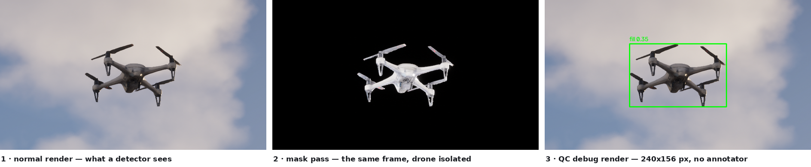
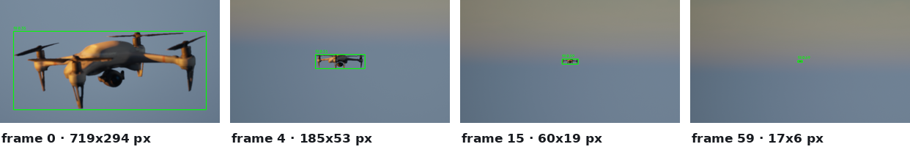
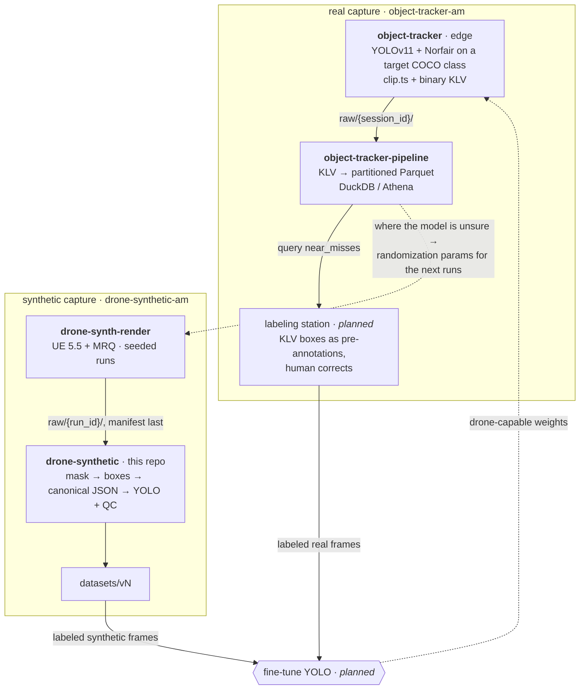

# drone-synthetic

Synthetic training-data pipeline for drone detection. UE 5.5 renders paired
frames — a normal render and a drone-on-black mask render from identical
camera paths — and this pipeline turns those pairs into versioned, QC'd YOLO
datasets. S3 is the system of record; conversion runs as a containerized job
on AWS Batch.



Labels come from the mask pass rather than from an annotator: thresholding the
silhouette gives exact box extents at any scale. The `fill 0.35` is the box's
mask fill ratio — a quadcopter is mostly air between its arms — and a drop in
it is one of the signals QC flags for review. The third panel is the
pipeline's own debug render, not an illustration.



A single run also carries the object from 719x294 px down to 17x6 as the drone
flies away — forty-fold in linear size, two thousand-fold in area. That
variation is what a detector needs and what is most tedious to collect and
label by hand.

Both images are generated from a converted run by
[scripts/make_demo_assets.py](scripts/make_demo_assets.py) — currently
`run_20260726_044311_1120`. The run id is recorded here so it is possible to
tell whether the figures still reflect what the pipeline produces.

## Architecture

Everything in the diagram is live: ingest writes runs to S3, and
`dronesynth submit` converts them on AWS Batch (Fargate) using the image in
ECR. The same container also runs locally via `docker run` — that is the
debugging path, not a separate implementation.

Conversion also triggers itself: an EventBridge rule watches for
`raw/*/manifest.json` landing (the manifest-last protocol makes that the
run-complete signal) and a small Lambda submits the Batch job, writing
dataset version `auto-<run_id>`. Manual `dronesynth submit` remains for
curated multi-run versions and re-runs.

Two things write to `raw/`, and they render by different means. The diagram
below is the manual path: an EasySynth capture that `dronesynth ingest`
validates and uploads. The other is
[drone-synth-render](https://github.com/AlaricManning/drone-synth-render), an
Unreal orchestrator that drives Movie Render Queue directly, renders
unattended, and publishes finished runs itself — same layout, same
manifest-last protocol, but it never calls `dronesynth ingest`, so this
pipeline first sees those runs when EventBridge fires. Because it builds the
mask pass rather than taking a plugin's, it can isolate the drone and disable
temporal AA on that pass alone. Each producer has its own put-only identity;
see [Security model](#security-model).

```
Windows (UE 5.5 + EasySynth)
┌──────────────────────────────────────────┐
│ render → local disk (scratch)            │  renders are messy and can fail;
└────────────────┬─────────────────────────┘  local disk absorbs that
                 │
                 │  dronesynth ingest   (validates pairing/frame counts, writes
                 │                       manifest, uploads frames first,
                 ▼                       manifest LAST)
        s3://<bucket>/raw/<run_id>/
            ├── normal/
            ├── mask/                     a run with a manifest is complete by
            └── manifest.json             construction; without one, ignore it
                 │
                 │  dronesynth submit --run <run_id>
                 │  (or automatically: EventBridge fires
                 ▼   when manifest.json lands)
        AWS Batch job (Fargate, CPU) — containerized converter
            mask threshold → boxes → canonical JSON → YOLO export → QC
                 │
                 ▼
        s3://<bucket>/datasets/<version>/   canonical per-frame annotations,
            ├── annotations/                 a provenance sidecar per run,
            └── yolo/                        + YOLO images/labels layout
        s3://<bucket>/qc/<run_id>/          QC report + debug box renders
```

## Where this fits in the larger system

This repo is one station of a detection data flywheel spanning four
repositories. [drone-synth-render](https://github.com/AlaricManning/drone-synth-render)
renders the synthetic captures this pipeline converts;
[object-tracker](https://github.com/AlaricManning/object-tracker) and
[object-tracker-pipeline](https://github.com/AlaricManning/object-tracker-pipeline)
capture and catalog real footage at the edge. Both branches serve one end
goal — fine-tuning a YOLO model that can detect drones, which stock YOLOv11
cannot, because COCO has no `drone` class.



The two branches run in parallel and converge at fine-tuning. Synthetic
capture supplies labeled frames cheaply — the mask pass gives ground truth for
free — while the edge supplies the real-world distribution no renderer
reproduces. Neither substitutes for the other.

The real branch is not trainable yet, and the missing piece is labels. KLV
records what the model *predicted*, not what was actually there, so those clips
need a review step before they can train or even evaluate anything: scoring
precision against your own predictions returns 100% by construction. The
`near_misses` tier is the natural queue — it is where the model was unsure, so
it is where correction buys the most — and the catalog already puts that queue
one query away. If the labeling station emits the same canonical annotation
schema this pipeline writes, combining the branches is a concatenation rather
than an integration.

Ordering matters as well. The edge only records when it detects its target
class, so it cannot capture drone clips until a model can already detect
drones. v1 weights come from synthetic data alone, and the real branch starts
contributing only once those are deployed — the dashed edges above are that
second lap.

The systems couple through artifacts, never code: dataset version → model
weights → KLV catalog → randomization params. Separate buckets, separate
IAM identities.

## Design decisions

- **Runs are the atomic unit.** Each capture session is one immutable
  `run_id` with a manifest recording UE map, drone model, camera path, capture
  date, the domain-randomization parameters and seed behind it, and a
  `generator` stamp naming the producing repo and commit. That last field
  exists because config alone does not identify a build: when the renderer
  changes without the config changing, the commit is the only thing that
  separates one generation of data from the next. Runs are the
  unit of ingest, QC, provenance, and train/val splitting. Ingest writes the
  manifest only after every frame is in place, so a run without a manifest is
  always debris from a failed ingest, never a real run — and a run with one
  is immutable: re-ingesting an existing id is an error.
- **Canonical JSON annotations; YOLO is an export.** Mask renders carry
  segmentation information for free. Conversion writes per-frame JSON
  (boxes, mask area, fill ratio, component count) as the source of truth and
  generates the YOLO layout from it, so future COCO or segmentation exports
  are new exporters, not rewrites.
- **One object is one box, whatever the mask does.** Pixels are grouped by
  object, not by connectivity. The mask pass paints only the drone, so which
  object a pixel belongs to is known rather than inferred, and connectivity
  is a fact about rasterisation that only happened to stand in for it. It
  stopped standing in when propeller blades began detaching at oblique
  headings and each island became its own label, asserting that a 13x4 sliver
  inside a drone was a whole drone. The component count survives on the box
  so QC can still flag a fragmented mask as worth a look; see
  [docs/plans/instance-boxes.md](docs/plans/instance-boxes.md).
- **Datasets are versioned and deterministic.** A dataset version is fully
  determined by (input runs, conversion config). Same inputs, same output,
  always re-derivable.
- **Every conversion records the build and config behind it.** Alongside each
  run's annotations sits `<run_id>.provenance.json`, naming the converter commit
  and the mask settings the labels were produced under. Without it "same
  conversion config" is an assumption rather than a checkable claim: the mask
  threshold moved from 12 to 32 on 2026-07-26, which changed every label and
  left no trace in the output. Because the container has no `.git`, the commit
  is baked into the image at build time — use `scripts/build_image.sh`, which
  computes it, rather than a bare `docker build`.
- **The train/val split ships with the dataset, run-level, never
  frame-level.** Consecutive frames from one camera path are near-duplicate
  images, so a random frame-level split leaks train data into val and
  inflates metrics — and a consumer handed loose frames can't know that,
  since the sequence structure isn't visible in a folder of PNGs. As with
  COCO and ImageNet, the producer defines the split: whole runs are held out
  via `split.val_runs` in the **build** config, and frame-level splitting is
  rejected outright.
- **A split belongs to an assembled dataset, not to a conversion.** Converting
  one run answers "what is in these frames"; it has no split to make, because
  which runs a dataset contains is not decided yet. So `dronesynth build` takes
  an explicit set of runs, applies the split across them, and writes one
  dataset — see [docs/plans/dataset-build.md](docs/plans/dataset-build.md) for
  why this was not expressible before.
- **Run ids identify a render, not a scene.** They are timestamps, so two
  renders of the same seed get different ids; when two render batches collided,
  25 seeds rendered twice and produced pairs with identical trajectories. A
  run-level split would put one of each pair in train and its twin in val and
  report nothing wrong, so a build also refuses when a *scene* — seed together
  with the randomization, map, drone model and renderer commit that give it
  meaning — appears on both sides.
- **QC is the proof of quality.** Nothing downstream trains on this data
  within the pipeline, so the QC report (boxes per frame, box size
  distribution, mask fill ratio, empty-frame counts, and flagged outliers —
  tiny boxes, low fill, boxes touching the frame edge, and masks that arrived
  in more than one piece) and debug renders are the evidence the labels are
  good.

## Security model

| Identity       | Permissions                                  | Used by                 |
|----------------|----------------------------------------------|-------------------------|
| ingest user    | put-only on `raw/*` — no list, no delete     | `dronesynth ingest`     |
| render user    | put-only on `raw/*` — no list, no delete     | the `drone-synth-render` render box |
| batch job role | read `raw/*`; write `datasets/*` and `qc/*`  | the Fargate conversion job |
| build role     | read `raw/*` and `datasets/*`; write `datasets/*` | `dronesynth build` |
| admin          | full                                         | Terraform applies, browsing |

The two producers hold separate keys with the identical grant, so either can be
rotated or revoked without interrupting the other and every write under `raw/`
is attributable to the machine that made it.

The build role is separate from the conversion job role rather than shared with
it. Conversion has no reason to read `datasets/*`, so sharing would over-grant
it; and a build needs exactly that read, so a build running as the conversion
role would fail on `AccessDenied` while the identical code succeeded locally
under admin. It is assumed rather than held as a key, so a one-off local build
gets temporary credentials with the same grants a Batch build would have, and
CloudTrail attributes it to a session. Neither the build role nor the conversion
role can list the bucket: both are told what to read.

Leaked capture credentials must not allow enumerating or deleting captured
data. No credentials live in this repo, tracked or otherwise. All AWS
resources are provisioned by Terraform in `infra/`.

## Repository layout

```
configs/               conversion knobs (threshold, class map) + storage roots:
                       convert.yaml (local), convert.s3.yaml (all-S3, baked
                       into the container image); plus one build.<version>.yaml
                       per dataset version, naming its runs and val hold-out
src/dronesynth/
  ingest/              run registration, validation, manifest, S3 sync
  datagen/             pairing, mask→box, canonical JSON, exporters, QC,
                       and the multi-run dataset build
  storage/             local/S3 abstraction — same code both sides
  batch.py             job submission to AWS Batch
  provenance.py        which converter build and config produced some labels
  cli.py               ingest / convert / build / submit entrypoints
scripts/               operator tooling: bucket snapshot/prune, job resubmit
                       and wait, corpus verification, README figure generation
assets/                README figures, generated from a converted run
docker/                the conversion job image Batch runs
docs/                  RUNBOOK.md — operator procedures
docs/plans/            dated decision records, one per substantial change
infra/                 Terraform: bucket, IAM, ECR, Batch (applied)
tests/
data/                  gitignored local staging (raw/, datasets/, qc/)
```

## Usage

Day-to-day operator procedures — render day step-by-step, deploying config
or code changes, and failure recovery — live in the
[runbook](docs/RUNBOOK.md). The commands below are the short version.

After each render session, register the capture as a run:

```bash
AWS_PROFILE=drone-synth-ingest dronesynth ingest --config configs/convert.yaml \
  --normal /mnt/c/datasets/drone_normal --mask /mnt/c/datasets/drone_mask \
  --run-id run_0001 --ue-map testLevel --drone-model White_Drone \
  --raw-root s3://drone-synthetic-am/raw
```

This validates the capture (strict normal/mask pairing — broken renders are
rejected before anything is uploaded), flattens it into
`raw/run_0001/{normal,mask}/`, and writes the manifest last — with if-absent
semantics, so an existing run can never be overwritten. Omit `--raw-root`
(and the profile) to ingest to the local `data/raw` staging area from config
instead; local runs are what `convert` reads until the Batch job lands.

Then convert a registered run into a versioned dataset:

```bash
dronesynth convert --config configs/convert.yaml --run-id run_0001 --version v001
```

This writes canonical annotations and the YOLO layout to
`data/datasets/v001/` and the QC report plus debug renders (frames with the
detected boxes drawn on) to `data/qc/run_0001/`. Review flagged frames — and
ideally scrub the debug folder — before treating the dataset as good.

To run the conversion as the container does in production — everything in
and out of S3, using `configs/convert.s3.yaml`:

```bash
scripts/build_image.sh
docker run --rm -v ~/.aws:/home/app/.aws:ro -e AWS_PROFILE=default \
  dronesynth-convert --run-id run_0001 --version v001
```

`build_image.sh` wraps `docker build` only to stamp the current commit into the
image, since the converter cannot work that out from inside a container that
holds no `.git`. Building by hand still works and produces a usable image; its
datasets just record an unknown converter commit.

Credentials are never baked into the image: locally they come from the
read-only `~/.aws` mount; on Batch they come from the job role.

In production, conversion runs on AWS Batch instead — submit a job and watch
it through the queue:

```bash
dronesynth submit --run-id run_0001 --version v001
aws batch describe-jobs --jobs <job-id> --query 'jobs[0].status'
aws logs tail /aws/batch/job --since 15m   # the container's conversion summary
```

The job definition owns the image, roles, and resources; a submission only
contributes the run id and dataset version.

Conversion is per-run, so a trainable dataset is assembled separately, from a
config naming exactly which runs go in and which are held out:

```bash
dronesynth build --config configs/build.v002.s3.yaml --version v002
```

This reads each run's canonical annotations, copies the frames they label into
`images/{train,val}/`, derives the label files, and writes the dataset manifest
last. Nothing is re-thresholded: labels are a pure function of the annotations,
so a build cannot disagree with the QC report its inputs came from, and changing
the hold-out recopies frames while recomputing nothing.

Copies are key-to-key within storage, so on S3 the ~9 GB never leaves the
bucket — pulling it through the machine running the build would take longer than
the render did.

The build refuses rather than guesses. It will not overwrite an existing
version, mix runs converted under different mask configs or converter builds,
accept a run with no converter provenance, or put two renders of one scene on
opposite sides of the split. There is one build config per dataset version,
tracked in git, because which runs a dataset trains on is the decision most
worth being able to look up later.

`v002` is the current dataset: 50 runs, 3000 frames, 2400 train and 600 val on a
40/10 run split, labels at threshold 32. Frames are placed concurrently, since a
build transfers no image bytes and its duration is almost entirely per-request
round trips; how long one takes therefore depends more on the link to S3 than on
the corpus size. See `docs/plans/dataset-build.md` for measured numbers.

## Infrastructure

AWS resources are managed by Terraform in `infra/` and applied manually with
admin credentials:

```bash
cd infra
terraform init
terraform apply -var bucket_name=drone-synthetic-am
```

The capture access keys are created outside Terraform (state files store
secrets in plaintext) and live only in `~/.aws/credentials` on the machine
that needs them:

```bash
aws iam create-access-key --user-name drone-synth-ingest
aws iam create-access-key --user-name drone-synth-render
```

The build role is the exception to that pattern: it is assumed, not keyed, so
there is no long-lived credential to create. `terraform apply` trusts whoever
applied it, or pass `-var 'build_role_principals=["arn:aws:iam::…:user/you"]'`
to name someone else. Add a profile that assumes it and `dronesynth build` picks
it up like any other:

```ini
# ~/.aws/config
[profile drone-synth-build]
role_arn = arn:aws:iam::935961368629:role/dronesynth-build
source_profile = default
region = us-east-1
```

`region` is not optional here: it is resolved per profile and is not inherited
from `source_profile`, so without it boto3 has no region and the build fails
before it reads anything.

## Development setup

```bash
python3 -m venv .venv
source .venv/bin/activate
pip install -e ".[dev]"
dronesynth --help
pytest
```

Development happens in WSL. Captures ingested by hand are read from the
Windows side via `/mnt/c/datasets` during local development and via S3 in
production; runs published by `drone-synth-render` only ever arrive through
S3, since it uploads them itself.
