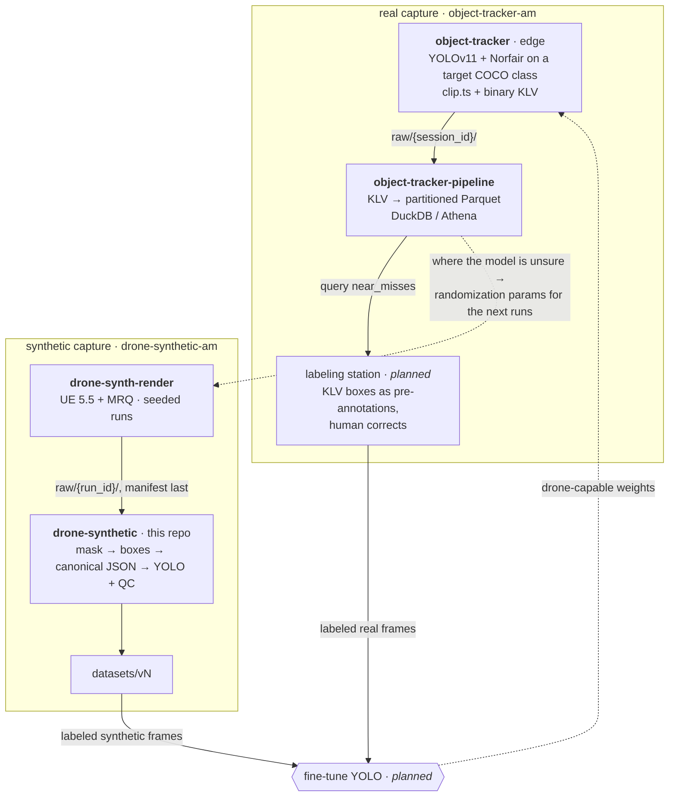

# drone-synthetic

Synthetic training-data pipeline for drone detection. UE 5.5 + EasySynth render
paired frames — a normal render and a drone-on-black mask render from identical
camera paths — and this pipeline turns those pairs into versioned, QC'd YOLO
datasets. S3 is the system of record; conversion runs as a containerized job
on AWS Batch.


Labels come from the mask pass rather than from an annotator: thresholding the
silhouette gives exact box extents at any scale. The `fill 0.35` is the box's
mask fill ratio — a quadcopter is mostly air between its arms — and a drop in
it is one of the signals QC flags for review. The third panel is the
pipeline's own debug render, not an illustration.


One run also spans an order of magnitude of object scale as the drone flies
away. That variation is what a detector needs and what is most tedious to
collect and label by hand.

Both images are generated from a converted run by
[scripts/make_demo_assets.py](scripts/make_demo_assets.py).

## Architecture

Everything in the diagram is live: ingest writes runs to S3, and
`dronesynth submit` converts them on AWS Batch (Fargate) using the image in
ECR. The same container also runs locally via `docker run` — that is the
debugging path, not a separate implementation.

Conversion also triggers itself: an EventBridge rule watches for
`raw/*/manifest.json` landing (the manifest-last protocol makes that the
run-complete signal) and a small Lambda submits the Batch job, writing
dataset version `auto-<run_id>`. Manual `dronesynth submit` remains for
curated multi-run versions and re-runs.

Two things write to `raw/`. The diagram below is the manual path: an EasySynth
capture that `dronesynth ingest` validates and uploads. The other is
[drone-synth-render](https://github.com/AlaricManning/drone-synth-render), an
Unreal orchestrator that renders unattended and publishes finished runs itself
— same layout, same manifest-last protocol, but it never calls `dronesynth
ingest`, so this pipeline first sees those runs when EventBridge fires. Each
producer has its own put-only identity; see [Security model](#security-model).

```
Windows (UE 5.5 + EasySynth)
┌──────────────────────────────────────────┐
│ render → local disk (scratch)            │  renders are messy and can fail;
└────────────────┬─────────────────────────┘  local disk absorbs that
                 │
                 │  dronesynth ingest   (validates pairing/frame counts, writes
                 │                       manifest, uploads frames first,
                 ▼                       manifest LAST)
        s3://<bucket>/raw/<run_id>/
            ├── normal/
            ├── mask/                     a run with a manifest is complete by
            └── manifest.json             construction; without one, ignore it
                 │
                 │  dronesynth submit --run <run_id>
                 │  (or automatically: EventBridge fires
                 ▼   when manifest.json lands)
        AWS Batch job (Fargate, CPU) — containerized converter
            mask threshold → boxes → canonical JSON → YOLO export → QC
                 │
                 ▼
        s3://<bucket>/datasets/<version>/   canonical per-frame annotations
            ├── annotations/                 + YOLO images/labels layout
            └── yolo/
        s3://<bucket>/qc/<run_id>/          QC report + debug box renders
```

## Where this fits in the larger system

This repo is one station of a detection data flywheel spanning four
repositories. [drone-synth-render](https://github.com/AlaricManning/drone-synth-render)
renders the synthetic captures this pipeline converts;
[object-tracker](https://github.com/AlaricManning/object-tracker) and
[object-tracker-pipeline](https://github.com/AlaricManning/object-tracker-pipeline)
capture and catalog real footage at the edge. Both branches serve one end
goal — fine-tuning a YOLO model that can detect drones, which stock YOLOv11
cannot, because COCO has no `drone` class.



The two branches run in parallel and converge at fine-tuning. Synthetic
capture supplies labeled frames cheaply — the mask pass gives ground truth for
free — while the edge supplies the real-world distribution no renderer
reproduces. Neither substitutes for the other.

The real branch is not trainable yet, and the missing piece is labels. KLV
records what the model *predicted*, not what was actually there, so those clips
need a review step before they can train or even evaluate anything: scoring
precision against your own predictions returns 100% by construction. The
`near_misses` tier is the natural queue — it is where the model was unsure, so
it is where correction buys the most — and the catalog already puts that queue
one query away. If the labeling station emits the same canonical annotation
schema this pipeline writes, combining the branches is a concatenation rather
than an integration.

Ordering matters as well. The edge only records when it detects its target
class, so it cannot capture drone clips until a model can already detect
drones. v1 weights come from synthetic data alone, and the real branch starts
contributing only once those are deployed — the dashed edges above are that
second lap.

The systems couple through artifacts, never code: dataset version → model
weights → KLV catalog → randomization params. Separate buckets, separate
IAM identities.

## Design decisions

- **Runs are the atomic unit.** Each capture session is one immutable
  `run_id` with a manifest recording UE map, drone model, camera path, capture
  date, and the domain-randomization parameters and seed behind it. Runs are the
  unit of ingest, QC, provenance, and train/val splitting. Ingest writes the
  manifest only after every frame is in place, so a run without a manifest is
  always debris from a failed ingest, never a real run — and a run with one
  is immutable: re-ingesting an existing id is an error.
- **Canonical JSON annotations; YOLO is an export.** Mask renders carry
  segmentation information for free. Conversion writes per-frame JSON
  (boxes, mask area, fill ratio) as the source of truth and generates the
  YOLO layout from it, so future COCO or segmentation exports are new
  exporters, not rewrites.
- **Datasets are versioned and deterministic.** A dataset version is fully
  determined by (input runs, conversion config). Same inputs, same output,
  always re-derivable.
- **The train/val split ships with the dataset, run-level, never
  frame-level.** Consecutive frames from one camera path are near-duplicate
  images, so a random frame-level split leaks train data into val and
  inflates metrics — and a consumer handed loose frames can't know that,
  since the sequence structure isn't visible in a folder of PNGs. As with
  COCO and ImageNet, the producer defines the split: whole runs are held
  out via `split.val_runs` in the config, and frame-level splitting is
  rejected outright. (With one run captured, val is empty until the first
  held-out run is added.)
- **QC is the proof of quality.** Nothing downstream trains on this data
  within the pipeline, so the QC report (boxes per frame, box size
  distribution, mask fill ratio, empty-frame counts, flagged outliers) and
  debug renders are the evidence the labels are good.

## Security model

| Identity       | Permissions                                  | Used by                 |
|----------------|----------------------------------------------|-------------------------|
| ingest user    | put-only on `raw/*` — no list, no delete     | `dronesynth ingest`     |
| render user    | put-only on `raw/*` — no list, no delete     | the `drone-synth-render` render box |
| batch job role | read `raw/*`; write `datasets/*` and `qc/*`  | the Fargate conversion job |
| admin          | full                                         | Terraform applies, browsing |

The two producers hold separate keys with the identical grant, so either can be
rotated or revoked without interrupting the other and every write under `raw/`
is attributable to the machine that made it.

Leaked capture credentials must not allow enumerating or deleting captured
data. No credentials live in this repo, tracked or otherwise. All AWS
resources are provisioned by Terraform in `infra/`.

## Repository layout

```
configs/               conversion knobs (threshold, split policy, class map)
                       + storage roots: convert.yaml (local), convert.s3.yaml
                       (all-S3, baked into the container image)
src/dronesynth/
  ingest/              run registration, validation, manifest, S3 sync
  datagen/             pairing, mask→box, canonical JSON, exporters, QC
  storage/             local/S3 abstraction — same code both sides
  batch.py             job submission to AWS Batch
  cli.py               ingest / convert / submit entrypoints
docker/                the conversion job image Batch runs
docs/                  RUNBOOK.md — operator procedures
docs/plans/            dated decision records, one per substantial change
infra/                 Terraform: bucket, IAM, ECR, Batch (applied)
tests/
data/                  gitignored local staging (raw/, datasets/, qc/)
```

## Usage

Day-to-day operator procedures — render day step-by-step, deploying config
or code changes, and failure recovery — live in the
[runbook](docs/RUNBOOK.md). The commands below are the short version.

After each render session, register the capture as a run:

```bash
AWS_PROFILE=drone-synth-ingest dronesynth ingest --config configs/convert.yaml \
  --normal /mnt/c/datasets/drone_normal --mask /mnt/c/datasets/drone_mask \
  --run-id run_0001 --ue-map testLevel --drone-model White_Drone \
  --raw-root s3://drone-synthetic-am/raw
```

This validates the capture (strict normal/mask pairing — broken renders are
rejected before anything is uploaded), flattens it into
`raw/run_0001/{normal,mask}/`, and writes the manifest last — with if-absent
semantics, so an existing run can never be overwritten. Omit `--raw-root`
(and the profile) to ingest to the local `data/raw` staging area from config
instead; local runs are what `convert` reads until the Batch job lands.

Then convert a registered run into a versioned dataset:

```bash
dronesynth convert --config configs/convert.yaml --run-id run_0001 --version v001
```

This writes canonical annotations and the YOLO layout to
`data/datasets/v001/` and the QC report plus debug renders (frames with the
detected boxes drawn on) to `data/qc/run_0001/`. Review flagged frames — and
ideally scrub the debug folder — before treating the dataset as good.

To run the conversion as the container does in production — everything in
and out of S3, using `configs/convert.s3.yaml`:

```bash
docker build -f docker/Dockerfile -t dronesynth-convert .
docker run --rm -v ~/.aws:/home/app/.aws:ro -e AWS_PROFILE=default \
  dronesynth-convert --run-id run_0001 --version v001
```

Credentials are never baked into the image: locally they come from the
read-only `~/.aws` mount; on Batch they come from the job role.

In production, conversion runs on AWS Batch instead — submit a job and watch
it through the queue:

```bash
dronesynth submit --run-id run_0001 --version v001
aws batch describe-jobs --jobs <job-id> --query 'jobs[0].status'
aws logs tail /aws/batch/job --since 15m   # the container's conversion summary
```

The job definition owns the image, roles, and resources; a submission only
contributes the run id and dataset version.

## Infrastructure

AWS resources are managed by Terraform in `infra/` and applied manually with
admin credentials:

```bash
cd infra
terraform init
terraform apply -var bucket_name=drone-synthetic-am
```

The capture access keys are created outside Terraform (state files store
secrets in plaintext) and live only in `~/.aws/credentials` on the machine
that needs them:

```bash
aws iam create-access-key --user-name drone-synth-ingest
aws iam create-access-key --user-name drone-synth-render
```

## Development setup

```bash
python3 -m venv .venv
source .venv/bin/activate
pip install -e ".[dev]"
dronesynth --help
pytest
```

Development happens in WSL; EasySynth captures on the Windows side are read
via `/mnt/c/datasets` during local development and via S3 in production.
